# Konix - Trade Execution Platform

Welcome to the Konix trade execution platform repository! 🎉

## Overview
Konix is a full-stack application developed to provide users with a realistic stock market trading experience without the need to invest real money. The platform allows users to engage in paper trading, helping them learn and understand how the stock market works.

## Tech Stack
- **Backend**: [](https://ktor.io/)
- **Database**: [](https://www.mysql.com/)
- **Authentication**: [](https://jwt.io/)
- **Email Client**: [](https://sendgrid.com/)
- **Android App**: [](https://kotlinlang.org/)

## Features
- **Paper Trading**: Allows users to simulate stock trading without real money, promoting learning and experience.
- **Real-Time Graphs**: Displays cumulative and real-time stock price graphs for various companies.
- **Artificial Supply-Demand**: Simulates stock price movements based on artificial supply and demand models.
- **Authentication**: Secure authentication using JWT tokens.
- **Email Verification**: OTP verification via email using SendGrid.

## Project Details
The Konix platform is designed to offer users an educational and risk-free experience of stock market trading. By simulating real-time market conditions and providing tools such as price graphs and supply-demand models, users can practice and learn about trading strategies, market behaviors, and investment decision-making.

## Android App Demo

### Login Screen
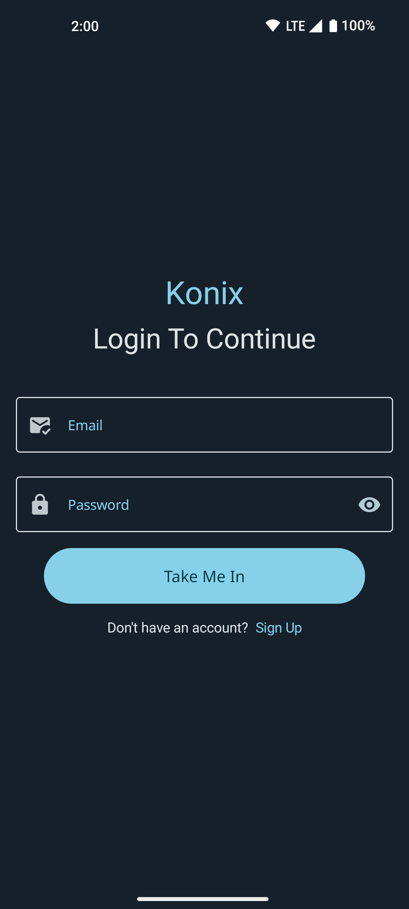

### Signup Screen
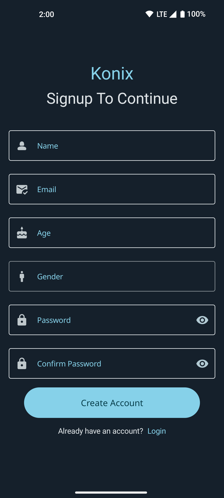

### Home Screen
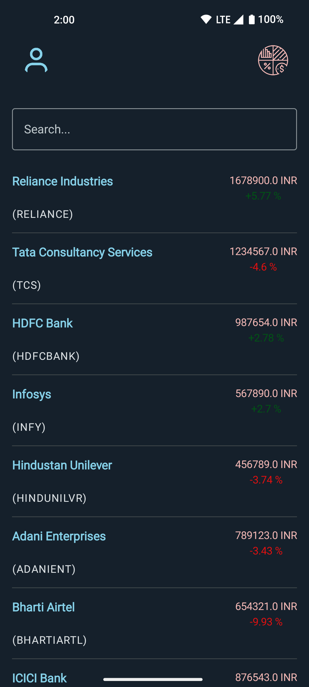

### Profile Screen
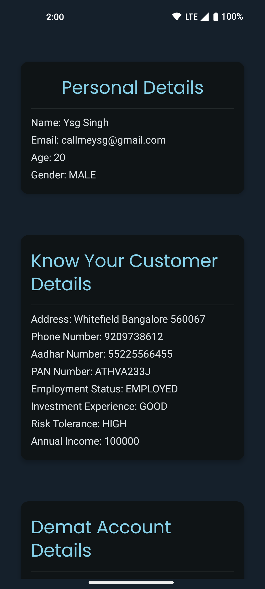

### Portfolio Screen
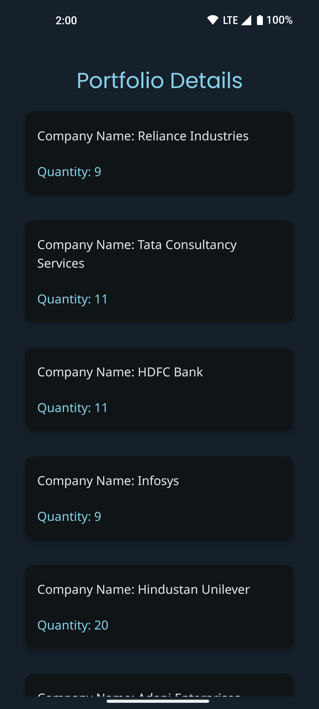

### Company Detail Screen
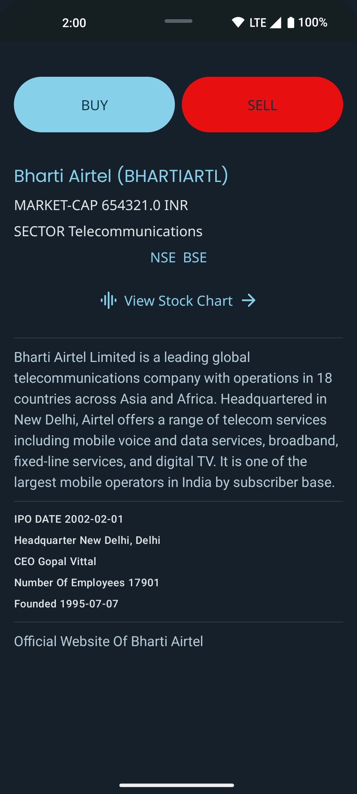

### Cummlative Stock Chart Screen
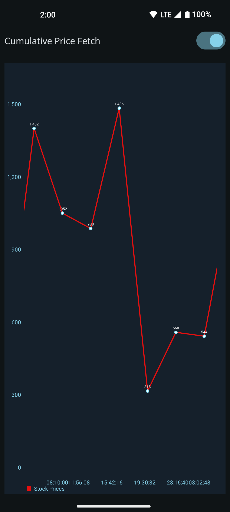

### Realtime Stock Chart Screen
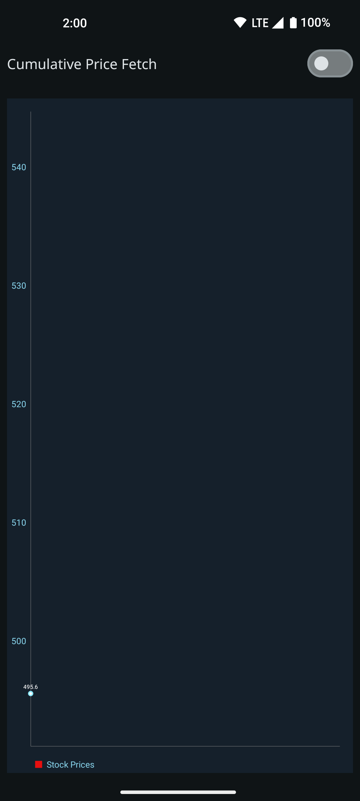

### Buy Limit Order Screen
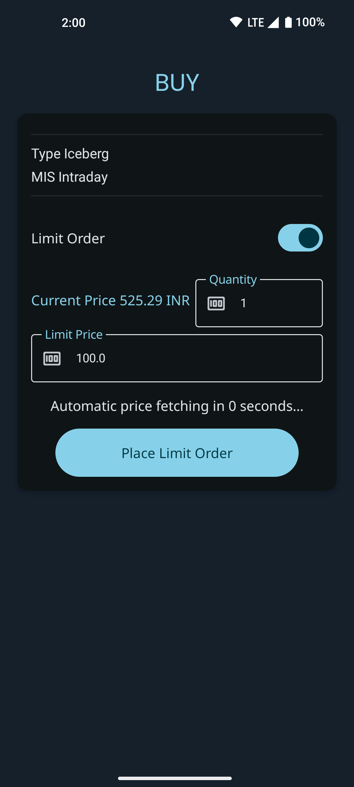

### Buy Market Order Screen
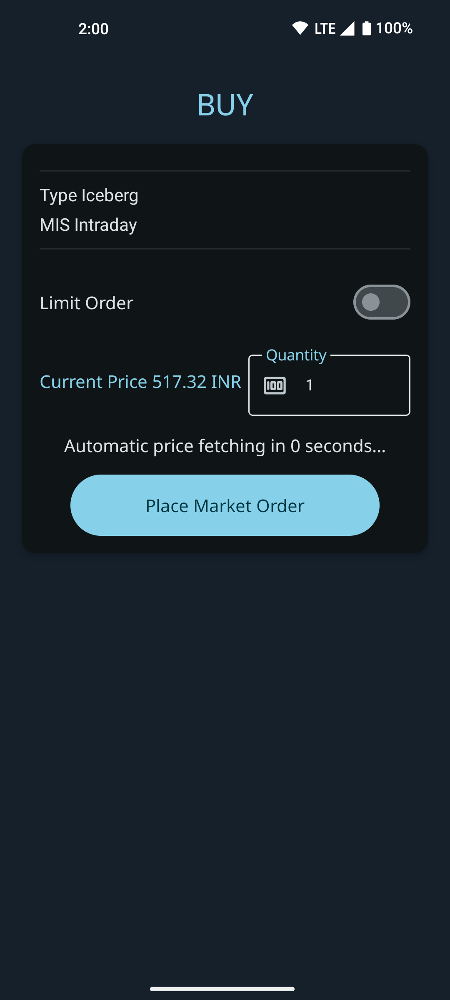

### Sell Limit Order Screen


### Order History Screen
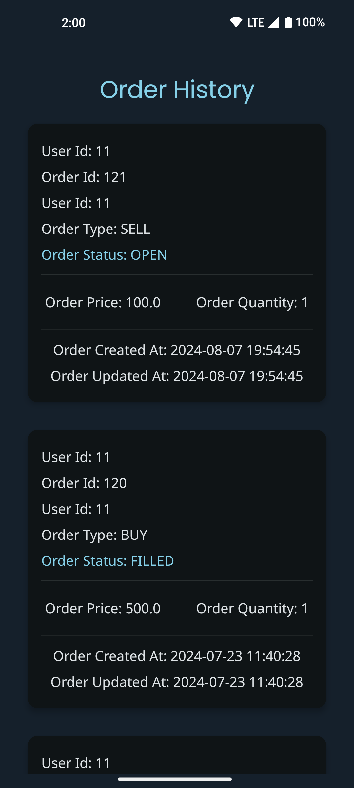

### NSE Detail Screen Screen
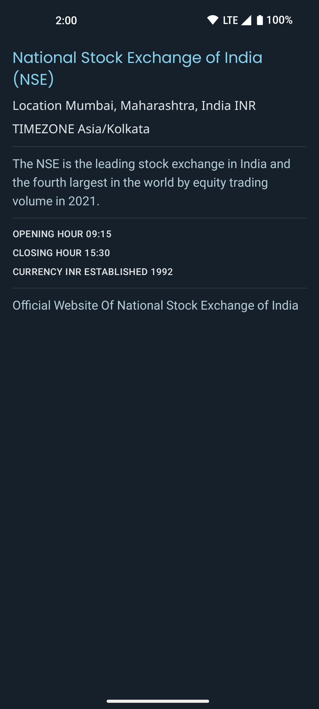

### BSE Detail Screen Screen
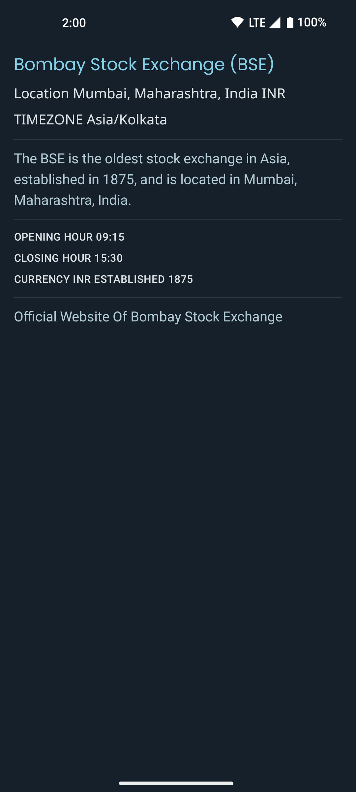

## Setup
1. **Backend (Ktor)**:
   - Clone the repository.
   - Navigate to the `backend` directory.
   - Install dependencies: 
     ```bash
     ./gradlew build
     ```
   - Run the server: 
     ```bash
     ./gradlew run
     ```

2. **Database (MySQL)**:
   - Ensure MySQL is installed and running.
   - Create a new database or use an existing one.
   - Import the database schema provided in the `database` directory.

3. **Android App**:
   - Open the project in Android Studio.
   - Build and run the app on an emulator or physical device.

## License
This project is licensed under the [MIT License](LICENSE).

Feel free to contribute and improve this project. Happy coding! 🚀
